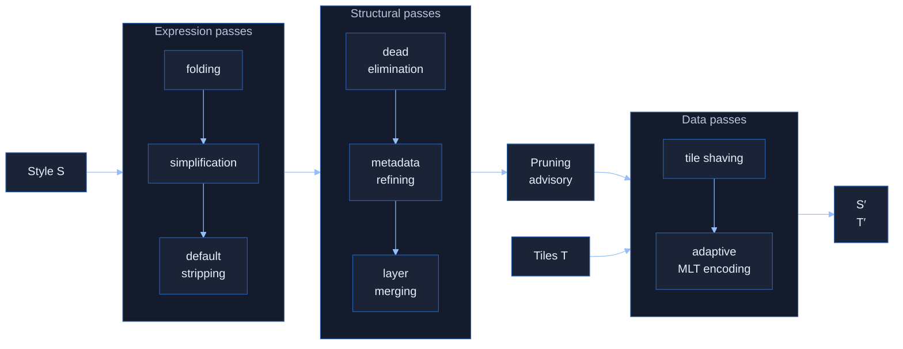
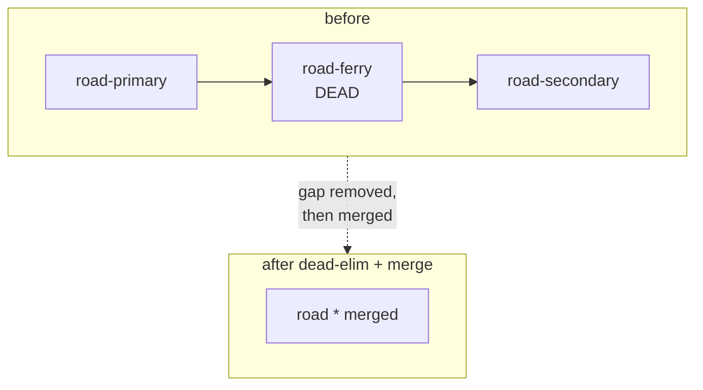

<div class="relative z-10">

# Automatic Data & Style-Driven<br>Map Optimization

<div class="text-xl opacity-90 mt-2">
Joint style + tile co-optimization for scalable vector maps
</div>

</div>

<div class="globe-corner">
  <GlobeMap height="130vh" :zoom="2.2" />
</div>

<div class="abs-bl m-6 text-sm opacity-80 relative z-10">
Frank Elsinga - M.Sc. Defense<br>
Examiner: Prof. Dr. Martin Werner<br>
Supervisors: Paul Walther, Balthasar Teuscher
</div>

---

# An interactive map runs two paths

<v-clicks>

- **Per-tile path** (load time)<br>
  fetch tiles -> decode -> bind style to every feature
- **Per-frame path** (render time)<br>
  re-evaluate view-dependent expressions -> draw calls -> GPU

</v-clicks>

<div v-click class="mt-6 finding-box">
A slow <strong>network</strong> stalls the first.<br>
A CPU/GPU/thermally-bound <strong>device</strong> stalls the second.
</div>

---

# The gap: each side optimizes alone

<div class="grid grid-cols-2 gap-8 mt-10">
<div v-click>

### Style
Tuned for **appearance**.<br>
Layers, filters, paint.

</div>
<div v-click>

### Tiles
Encoded **generically**.<br>
Every property, generic compression.

</div>
</div>

<div v-click class="mt-12 finding-box text-center text-lg">
A filter that folds away a property could let the encoder<br>
<strong>drop that whole column</strong> - but only if the two sides talk.
</div>

<div v-click class="mt-8 text-center text-2xl ml-accent">
Synergistic, or merely additive?
</div>

---

# Research questions

<div class="mt-12 space-y-10">

<div v-click class="flex items-center gap-6">
<span class="big-num">R1</span>
<div>
<div class="text-2xl"><strong>How much</strong> can co-optimization gain?</div>
<div class="muted">render performance + tile size</div>
</div>
</div>

<div v-click class="flex items-center gap-6">
<span class="big-num">R2</span>
<div>
<div class="text-2xl"><strong>Which passes</strong> matter, and do they compound?</div>
<div class="muted">additive or synergistic?</div>
</div>
</div>

<div v-click class="flex items-center gap-6">
<span class="big-num">R3</span>
<div>
<div class="text-2xl"><strong>What does it cost?</strong></div>
<div class="muted">preprocessing vs. the runtime payoff</div>
</div>
</div>

</div>

---

# Approach: a standalone co-optimizer

<div class="text-center mt-8 text-2xl">

$$ \mathcal{O}: \mathcal{S} \times \mathcal{T} \;\to\; \mathcal{S} \times \mathcal{T}, \qquad (S', T') = \mathcal{O}(S, T) $$

</div>

<div class="text-center muted mt-2">style + tiles in, optimized replacement out - same space</div>

<div class="grid grid-cols-2 gap-8 mt-12">
<div v-click class="finding-box">

### Visual equivalence
$$R(S,T,v)\neq\bot \,\Rightarrow\, R(S',T',v)\equiv R(S,T,v)$$
<div class="muted mt-2">Pixel-checked across zooms and viewports.<br><strong>May drop a render error, never add one</strong>.</div>

</div>
<div v-click class="finding-box">

### Strict idempotency
$$\mathcal{O}(\mathcal{O}(x)) = \mathcal{O}(x)$$
<div class="muted mt-2">Re-optimizing changes nothing. Proptest + libFuzzer</div>

</div>
</div>

---

# The three-level pipeline

<div class="flex justify-center">



</div>

<div class="flex flex-col items-center mt-3">
<div class="text-sm ml-accent">simpler</div>
<div class="w-3/4 h-0.5 bg-white/40 relative">
<div class="absolute right-0 -top-1.5 w-0 h-0 border-y-6 border-y-transparent border-l-8 border-l-white/40"></div>
</div>
</div>

<div class="muted text-center mt-4">
Ordering addresses the <strong>phase-ordering problem</strong>.
</div>

---

# Expression Pass Optimisation

<div class="grid grid-cols-2 gap-6 mt-4">
<div>

Peephole rewrites run to a **fixpoint**:
constant/stats-driven folding, algebraic simplification, default stripping, selectivity reordering, ...

<div class="muted mt-3">
Simple, semantics-preserving rules.
Non-confluent, but iterating until no rule fires is sound for any order.
</div>

</div>
<div>

````md magic-move
```json
// any-of-alls
["any",
  ["all",
    ["has","name"],
    ["==",["get","class"],"road"]],
  ["all",
    ["has","name"],
    ["==",["get","class"],"rail"]
  ]
]
```
```json
// factored result
["all",
  ["has","name"],
  ["in", 
    ["get","class"],
    ["literal", ["road","rail"]]
  ]
]
```
````

</div>
</div>

<div v-click class="mt-3 finding-box">
Barely move load time (<strong>−2.0%</strong> median).

Value is <strong>enabling downstream passes</strong> - narrowing the advisory, exposing dead layers.
</div>

---

# Structural passes: synergy *within* the family

<div class="grid grid-cols-2 gap-6 mt-4">
<div>

Typed passes over the whole style document:
**dead elimination**, metadata refinement, **layer merging**, cleanup.

<v-clicks>

- Dead elimination removes layers whose filters are unsatisfiable -> fewer per-frame draw calls
- Layer merging combines adjacent layers with compatible filters -> fewer render passes

</v-clicks>

</div>
<div>



</div>
</div>

<div v-click class="mt-3 finding-box">
<strong>These two are synergistic:</strong> a dead layer between two mergeable layers blocks
the merge. Dead elimination removes the gap, then merging fires.
<span class="muted">Fiord −36.8% expression-tree nodes; Liberty merged 4 layer pairs.</span>
</div>

---

# Style-driven tile shaving

<div class="mt-4">

The optimized style yields a **pruning advisory**: which properties, geometry types, and
feature values are actually referenced. Everything else is **removed from every tile**.

</div>

<div class="grid grid-cols-2 gap-8 mt-4 items-center">
<div>


</div>
<div>

- A general schema (OMT) exposes hundreds of properties; any one style uses a fraction
- On-wire reduction **19.8% (Bright) -> 46.3% (Toner)**, median **29%**
- *No single optimal tile* - the best encoding depends on the style

<div v-click class="finding-box mt-4">
Shaving alone drops pooled median load time <strong>396 ms -> 134 ms (−66%)</strong>
and lifts FPS <strong>+102%</strong>.
</div>

</div>
</div>

---

# Adaptive MLT encoder

<div class="w-1/2">

Instead of a fixed per-column plan, **compete strategies at encode time**:
sort orderings, integer codecs, string compression (dictionary / FSST), shared dictionaries.

<v-clicks>

- vs. reference MLT: **−28.4%** uncompressed
- vs. gzip-MVT: **−12.3%**; vs. zstd-22-MVT: **−13.0%**
- Naive cost would be 4×; bounding-box pruning + profiling + warm-start -> **1.95×**

</v-clicks>

<div v-click class="mt-6 finding-box">
The win is the <strong>strategy competition, not the columnar format</strong>: the reference
MLT under gzip is actually <em>worse</em> than gzip-MVT. Our uncompressed output (3.06 GB) already
beats MVT+gzip (3.08 GB).
</div>

</div>

<div class="absolute top-0 right-0 w-1/2 h-full flex items-center justify-center p-4">
  
</div>

---
layout: center
---

# Evaluation

<div class="grid grid-cols-2 gap-10 mt-2">
<div>

### Four complementary corpora
- **Germany OMT** - encoder-only baseline (256.5 k tiles)
- **10-style deep corpus** - end-to-end browser benchmarks
- **11-style subset** - tile-shaving effectiveness
- **13-style Maputnik** - static passes, generalization

### Method
**18 scenarios** on **19-step cumulative ablation** with fixed pass order

</div>
<div>

<CameraTour />

</div>
</div>

---

# Headline results

<div class="grid grid-cols-4 gap-4 mt-8 text-center">
<div v-click>
<div class="big-num">−71%</div>
<div class="muted">median load time<br>(63–74%, 10 styles)</div>
</div>
<div v-click>
<div class="big-num">+152%</div>
<div class="muted">median FPS<br>(100–200%)</div>
</div>
<div v-click>
<div class="big-num">−28%</div>
<div class="muted">tile volume vs.<br>reference encoder</div>
</div>
<div v-click>
<div class="big-num">4.6–8.3×</div>
<div class="muted">decode throughput<br>(native µbench)</div>
</div>
</div>

<div v-click class="mt-10">

<div class="muted text-center">Fiord load time across configs: baseline -> style-only -> shaving -> +MLT</div>
</div>

---

# The central finding: additive, not synergistic

<div class="mt-6 finding-box text-lg">
We <strong>expected</strong> style-level dead-elimination to narrow the advisory and
<strong>compound</strong> with data-level shaving on tile size.
</div>

<div v-click class="mt-6 finding-box text-lg">
The aggregate shows <strong>combined ≈ style-only + shaving-only</strong>.
Fiord: combined 14.7% vs. style-only 14.5%. Liberty: 4.8% = 4.8%. <strong>Additive.</strong>
</div>

<div v-click class="mt-6 grid grid-cols-2 gap-8">
<div>

Per-scenario synergy appears in **17 / 36** style–scenario pairs - too sparse to lift the aggregate.

</div>
<div class="finding-box">

**Good news for deployment:** the three families are *independently adoptable*. Mobile/network ->
prioritize shaving + encoding. Desktop/draw-call bound -> structural passes alone.

</div>
</div>

---

# Threats & scope

<div class="grid grid-cols-2 gap-8 mt-6">
<div>

### Honest limitations
- Headline FPS measured on a **desktop workstation**, not a battery device; **no direct energy** measurement
- Jank metric *worsens* >2000 FPS - small GC pauses become proportionally large (a regime real hardware never enters)
- Rust decoder's 4.6–8.3× **not yet deployed** in-browser (WASM–JS boundary cost remains)

</div>
<div>

### Deliberately out of scope
- **Geometry simplification** (would break pixel-identity)
- **Symbol-layer merging** (per-layer collision detection)
- Proprietary styles (Mapbox/Esri ToS) - results confirmed on **open-source styles**
- MinHash τ tuned on Germany OMT only

</div>
</div>

---

# Conclusion

<div class="mt-4 space-y-3">

<div v-click><strong>R1 - Yes, meaningfully.</strong> −71% load, +152% FPS, −28%/−12% tile size. Not uniform: verbose institutional styles benefit far more than compact basemaps.</div>

<div v-click><strong>R2 - Tile shaving dominates;</strong> structural passes synergize internally; style×data composes <em>additively</em>. Three independently-adoptable mechanisms.</div>

<div v-click><strong>R3 - Re-encoding is the cost driver</strong> (~2 min/tileset at 16 threads, amortized once). Decode latency is the most dramatic gain; transfer size the most reliable.</div>

</div>

<div v-click class="mt-6 finding-box">

### Future work
Online/incremental serving · selective column decoding (late materialization) ·
equality saturation for the rewrite engine · Rust->WASM decoder in MapLibre GL JS

</div>

<div v-click class="text-center text-xl ml-accent mt-6">Thank you - questions?</div>

---
layout: section
class: text-center
background: '#111725'
---

# Backup slides

<div class="muted">anticipated questions</div>

---

# Synergy failed - why call it *joint* optimization?

<div class="mt-4 finding-box">

The **mechanism** is genuinely joint: the data-level advisory is *derived from the optimized
style*. Without the style passes there is no advisory. That the size *reductions* happen to sum
rather than super-add is an **empirical finding about magnitude**, not a refutation of the coupling.

</div>

<v-clicks>

- The formal object $\mathcal{O}: \mathcal{S}\times\mathcal{T}\to\mathcal{S}\times\mathcal{T}$ is what made the additive-vs-synergistic question *askable* - that's contribution C1.
- Two separate tools could not enforce the joint soundness criterion (a style edit must remain consistent with what was shaved from the tile).
- Synergy *does* occur per-scenario (17/36) - it exists, it's just not large enough to dominate the aggregate.

</v-clicks>

---

# Desktop numbers - do they hold on real devices?

<div class="grid grid-cols-2 gap-6 mt-4">
<div>

- **Transfer size** is deterministic under compression - device-independent. The −28%/−71% bytes hold everywhere.
- **FPS headroom**: >1000 FPS on the host means the renderer is GPU-idle. On a capped device that headroom converts to *sustained* frame rate and *lower* energy.
- Frame-time percentiles (p95/p99) improve too, not just the mean.

</div>
<div>


<div class="muted">Jank count - note it worsens only in the >2000 FPS regime real hardware never reaches.</div>

</div>
</div>

<div class="muted mt-3">No direct energy measurement - transfer size and frame rate are well-established mobile proxies.</div>

---

# Is the 4.6–8.3× decode speedup real in production?

<div class="mt-4 finding-box">
It is a <strong>native Rust Criterion micro-benchmark</strong> (full decode, 100 samples/cell, zoom 4/7/13).
The browser <code>loadMs</code> numbers do <strong>not</strong> use it - they use the existing JS MLT decoder.
</div>

<v-clicks>

- A Rust->WASM port would pay a WASM–JS boundary cost: per-column copies into JS typed arrays, GC pressure, 128-bit SIMD cap.
- Jangda et al. (2019): 45–55% WASM-vs-native slowdown on SPEC CPU.
- Expectation: full advantage on **large, feature-dense** tiles; near-parity on small tiles.
- This is why the headline live numbers are attributed to **shaving**, not the decoder.

</v-clicks>

---

# How is visual equivalence actually verified?

<div class="mt-6">

- Both pipelines render the corpus through MapLibre GL JS's **Node software rasterizer** at `pixelRatio` 1.
- Compared **pixel-for-pixel** with `pixelmatch` using the upstream render-harness defaults:
  `allowed = 0.00025`, YIQ-perceptual `threshold = 0.1285`.
- Encoder soundness: **round-trip property tests + libFuzzer**; no regressions across the corpus.
- Idempotency: $\mathcal{O}(\mathcal{O}(x)) = \mathcal{O}(x)$ checked as a test invariant.

</div>

<div class="muted mt-4">Caveat: this is the upstream perceptual tolerance, not bit-exactness. Sub-threshold differences are by construction invisible.</div>

---

# Cache fragmentation from style-specific tiles?

<div class="mt-4">

Shaved tiles are keyed on **(tile, style)** - a shared CDN can't pool them. Moving style *i* off the
shared MVT pool is net-beneficial when:

</div>

<div class="text-center text-xl my-4">

$$ r \;>\; \big[\, h(\Lambda_\mathcal{M}/N) - h(\lambda_i/N) \,\big] \cdot C_f $$

</div>

<v-clicks>

- With benchmark values ($r\approx3$ ms/tile, $C_f\approx25.8$ ms, $h\approx0.9$): tolerable hit-rate gap ≈ **11.6%**.
- ⇒ Shave the **1–2 dominant styles** that own the pool; leave the long tail on raw MVT.
- Driven by **traffic concentration**, not style count. (This is what Mapbox's closed "style-optimized vector tiles" likely does.)

</v-clicks>

---

# Expression-pass wins come from typos - non-representative?

<div class="mt-4 finding-box">
Correct - the large unary-simplification outliers trace to <strong>typos / suboptimal authoring</strong>
in specific styles. I report this explicitly and do <em>not</em> generalize it.
</div>

<v-clicks>

- That's exactly why I frame expression passes as **enablers**, not as a direct load-time lever (−2.0% median, within noise).
- The honest, generalizable expression result is the **static-corpus** number: median **31.4% raw** reduction across 13 unseen styles, none regressed.
- Initial complexity does *not* predict reduction ($r=0.35$, $p=0.24$, $n=13$) - a single high-leverage point (Americana) drives it; dropping it flips the sign.

</v-clicks>

---

# Non-confluent rewrites - why trust the result?

<div class="mt-6">

- Each rule is **individually semantics-preserving**; expressions are compositional.
- Iterating to a fixpoint is therefore **sound for any order** - different orders reach different but **visually-equivalent** normal forms.
- Termination: a well-founded measure (expression-tree size + a bounded promotion budget); hard cap 8 iters, converges in 2–3 in practice.

</div>

<div v-click class="mt-6 finding-box">
<strong>Equality saturation</strong> (egg) would remove the ordering dependence and find a global optimum -
flagged as future work. I'd only reach for it if rule-ordering sensitivity became a *measured* problem.
</div>

---

# What is yours vs. Rivian's on the encoder?

<div class="mt-6 grid grid-cols-2 gap-8">
<div>

### Mine
- The encoder **and its strategy-selection routine**
- Tile shaving + the pruning advisory
- The whole style-optimization pipeline
- All evaluation & analysis

</div>
<div>

### Rivian
- Runtime **performance engineering** of the encoder/decoder pair
- Transcode time: ~5 h (reference) -> **~1 min**

</div>
</div>

<div class="muted mt-6">
I credit the speedup to Rivian and deliberately do not analyze encoder *performance* as a contribution.
The compression *gains* (strategy selection) are mine and measured independently.
</div>

---

# Reference - per-zoom shaving & encoder

<div class="grid grid-cols-2 gap-4 mt-4">
<div>

</div>
<div>

</div>
</div>

<div class="muted text-center mt-2">Left: shaving across zoom (MVT vs MLT). Right: cross-style generalization, 13 unseen styles.</div>
