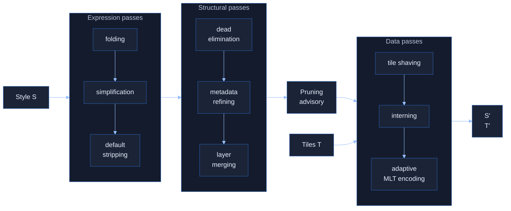
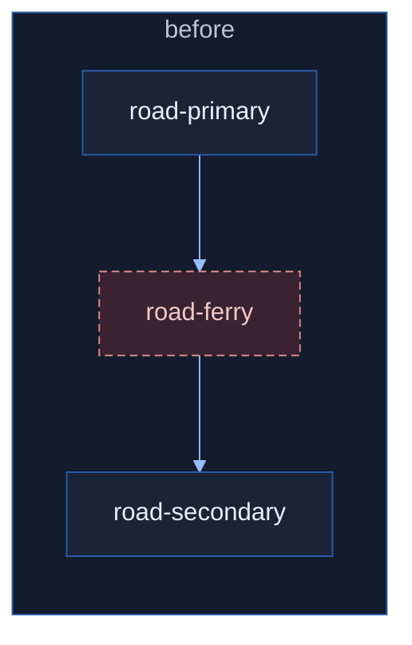
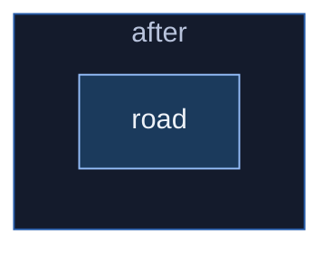

<div class="relative z-10">

# Automatic Data & Style-Driven<br>Map Optimization

<div class="text-xl opacity-90 mt-2">
Joint style + tile co-optimization for scalable vector maps
</div>

</div>

<div class="globe-corner">
  <GlobeMap height="130vh" :zoom="2.1" />
</div>

<div class="abs-bl mt-6  text-md opacity-80 relative z-10">
M.Sc. Defense Frank Elsinga<br>
Examiner Prof. Dr. Martin Werner<br>
Supervisors: Paul Walther, Balthasar Teuscher
</div>

---
layout: iframe-right
url: https://blog.openstreetmap.org/2025/07/22/vector-tiles-are-deployed-on-openstreetmap-org/
---

# Vector Tiles Just Went Mainstream

July 2025: **openstreetmap.org** ships vector tiles.

<div v-click>

**Tiles** + **style**, rendered in the browser, for Millions of users.<br>
Every **byte** and **frame** counts

</div>

---

# An Interactive Map Runs Two Paths

<v-clicks>

- **Load time**<br>
  fetch tiles -> decode -> bind style to every feature
- **Per-frame time**<br>
  re-evaluate view-dependent expressions -> draw calls -> GPU

</v-clicks>

<div v-click class="mt-6 finding-box">
A slow <strong>network</strong> stalls the first.<br>
A CPU/GPU/thermally-bound <strong>device</strong> stalls the second.
</div>

---

# The Gap: Each Side Optimizes Alone

<div class="grid grid-cols-2 gap-8 mt-10">
<div v-click class="text-center">

### Style
Tuned for **appearance**.

</div>
<div v-click class="text-center">

### Tiles
Encoded **generically**.

</div>
</div>

<div v-click class="mt-12  text-center text-lg">
Filter-folding a property lets encoder<br>
<strong>drop a column</strong> - if the two sides talk.
</div>

---

# Research Questions

<div class="mt-10 space-y-8">

<div v-click class="flex items-center gap-6">
<span class="big-num">R1</span>
<div>
<div class="text-2xl"><strong>How much</strong> can co-optimization gain?</div>
<div class="muted">render performance + tile size</div>
</div>
</div>

<div v-click class="flex items-center gap-6">
<span class="big-num">R2</span>
<div>
<div class="text-2xl"><strong>Which passes</strong> matter, and do they compound?</div>
<div class="muted">additive or synergistic?</div>
</div>
</div>

<div v-click class="flex items-center gap-6">
<span class="big-num">R3</span>
<div>
<div class="text-2xl"><strong>What does it cost?</strong></div>
<div class="muted">preprocessing vs. the runtime payoff</div>
</div>
</div>

</div>

<div v-click class="mt-10 text-center text-xl ml-accent">
The rest of this talk is these three questions.
</div>

---

# Approach: A Standalone Co-Optimizer

<div class="text-center mt-8 text-2xl">

$$ \mathcal{O}: \mathcal{S} \times \mathcal{T} \;\to\; \mathcal{S} \times \mathcal{T}, \qquad (S', T') = \mathcal{O}(S, T) $$

</div>

<div class="grid grid-cols-2 gap-10 mt-12">
<div v-click class="finding-box">

### Visual Equivalence
$$R(S,T,v)\neq\bot \,\Rightarrow\, R(S',T',v)\equiv R(S,T,v)$$
<div class="muted mt-2">Pixel-checked across zooms and viewports.<br><strong>May drop a render error</strong>, never add one.</div>

</div>
<div v-click class="finding-box">

### Strict Idempotency
$$\mathcal{O}(\mathcal{O}(x)) = \mathcal{O}(x)$$
<div class="muted mt-2">Re-optimizing changes nothing. Proptest + libFuzzer</div>

</div>
</div>

---

# The Three-Level Pipeline

<div class="flex justify-center">



</div>

<div>
<div class="flex items-center justify-center gap-4 mt-2 text-sm">
<span class="ml-accent">simpler / style rewrites</span>
<div class="w-64 h-2 rounded-full bg-gradient-to-r from-[#285DAA] to-[#95BEFA]"></div>
<span class="ml-accent">whole-document / data</span>
</div>

<div class="muted text-center -mt-1">
Scope
</div>
</div>

---

# Expression Passes

<div class="grid grid-cols-2 gap-6 mt-4">
<div>

Peephole rewrites run to a **fixpoint**:<br>
constant/stats-driven folding,<br>algebraic simplification, default stripping,<br>selectivity reordering, ...

<div class="muted mt-3">
Simple, semantics-preserving rules.
Non-confluent, but iterating until no rule fires is sound for any order.
</div>

</div>
<div>

````md magic-move
```json
// any-of-all
["any",
  ["all",
    ["has","name"],
    ["==",["get","class"],"road"]],
  ["all",
    ["has","name"],
    ["==",["get","class"],"rail"]
  ]
]
```
```json
// factored result
["all",
  ["has","name"],
  ["in", 
    ["get","class"],
    ["literal", ["road","rail"]]
  ]
]
```
````

</div>
</div>

<div v-click class="mt-3 finding-box">
Barely move load time (<strong>-2.0%</strong> median).

Value is <strong>enabling downstream passes</strong> - narrowing the advisory, exposing dead layers.
</div>

---

# Structural Passes: Synergy *Within* the Family

<div class="grid grid-cols-2 gap-6 mt-4">
<div>

Typed passes over the whole style document:<br>
**dead elimination**, metadata refinement, **layer merging**, cleanup.

<v-clicks>

- Dead elimination removes layers whose filters are unsatisfiable -> fewer per-frame draw calls
- Layer merging combines adjacent layers with compatible filters -> fewer render passes

</v-clicks>

</div>
<div>

<div v-click at="-2" class="grid grid-cols-2">





</div>
</div>
</div>

<div v-click class="mt-3 finding-box">
<strong>Synergistic:</strong> Dead layer between two mergeable layers may block the merge.<br>
Dead elimination removes the gap, then merging fires.
<span class="muted">Liberty merged 4 layers.</span>
</div>

---
layout: center
---

# How We Measure It

<div class="muted -mt-2 mb-8">Four complementary corpora, each chosen for what it isolates</div>

<div class="grid grid-cols-2 gap-x-8 gap-y-6">

<div v-click class="finding-box">
<div class="text-xl"><strong>end-to-end benchmarks</strong></div>
<div class="muted mt-1">10-style deep corpus</div>
</div>

<div v-click class="finding-box">
<div class="text-xl"><strong>static passes &amp; generalization</strong></div>
<div class="muted mt-1">13-style Maputnik</div>
</div>

<div v-click class="finding-box">
<div class="text-xl"><strong>tile-shaving effectiveness</strong></div>
<div class="muted mt-1">11-style subset</div>
</div>

<div v-click class="finding-box">
<div class="text-xl"><strong>encoder-only baseline</strong></div>
<div class="muted mt-1">Germany OMT</div>
</div>

</div>

---
layout: center
---

<div class="grid grid-cols-2 gap-6 -mx-12">
<div>

<div class="h-[430px]"><BenchExtent /></div>
<div class="muted text-center text-xs mt-1"><strong>Geographic extent</strong></div>

</div>
<div>

<div class="h-[430px]"><CameraTour /></div>
<div class="muted text-center text-xs mt-1">How the <strong>camera animates</strong></div>
</div>
</div>

<div class="text-center muted mt-3">
Running a 19-step cumulative ablation, fixed order x 15 runs + warmup
</div>

---
layout: section
---

<div class="flex items-center gap-6">
<span class="big-num">R1</span>
<div>
<div class="text-3xl"><strong>How much</strong> can co-optimization gain?</div>
<div class="muted mt-2">To what extent can it improve rendering and shrink tiles?</div>
</div>
</div>

---

# Headline Results

<div class="grid grid-cols-2 gap-8 mt-6 text-center">
<div v-click>
<div class="big-num">-71%</div>
<div class="muted">median load time (63-74%, 10 styles)</div>

<div class="muted text-xs mt-1">Fiord Load Time</div>
</div>
<div v-click>
<div class="big-num">+151%/div>
<div class="muted">median FPS (99.6-200.3%)</div>

<div class="muted text-xs mt-1">Fiord FPS</div>
</div>
</div>

<div class="grid grid-cols-2 gap-8 mt-6 text-center">
<div v-click>
<span class="text-3xl ml-accent font-bold">-28%</span>
<span class="muted ml-3">total tile size vs. reference encoder</span>
</div>
<div v-click>
<span class="text-3xl ml-accent font-bold">-29%</span>
<span class="muted ml-3">median tile-shaving (19.8-46.3%)</span>
</div>
</div>

<div v-click class="mt-4 text-center muted">
Not uniform: verbose institutional styles benefit far more than compact basemaps.
</div>

---

# Load-Time Wins From Tile Shaving

<div class="muted mt-2 mb-4">Advisory keeps only referenced properties, geometries, values - the rest is dropped from every tile.</div>

<div class="grid grid-cols-2 gap-8 items-center">

<div>

- On-wire **19.8% - 46.3%**, median **29%**
- *No single optimal tile* - depends on the style

</div>
</div>

---

# Adaptive MLT Encoder

<div class="w-1/2">

No fixed per-column plan, **compete strategies at encode time**:
sorting, integer codecs, string comp. (dictionary / FSST), shared dictionaries.

<v-clicks>

- vs. reference MLT: **-28.4%** uncompressed
- vs. gzip-MVT: **-12.3%**; vs. zstd-22-MVT: **-13.0%**
- **Naive** cost would be **4×**; BBox pruning + profiling + warm-start -> ours **1.95×**

</v-clicks>

<div v-click class="mt-6 finding-box">
Winning is <strong>strat. competition, not the format</strong>: Reference MLT under gzip is <em>worse</em> than gzip-MVT.
Our uncompressed output (3.06 GB) beats MVT+gzip (3.08 GB).
</div>

</div>

<div class="absolute top-0 right-0 w-1/2 h-full flex items-center justify-center p-4">
  
</div>

---
layout: section
---

<div class="flex items-center gap-6">
<span class="big-num">R2</span>
<div>
<div class="text-3xl"><strong>Which passes</strong> matter, and do they compound?</div>
<div class="muted mt-2">additive or synergistic?</div>
</div>
</div>

---

# Ranking the Passes - Memory


<div>

<div class="muted text-center text-sm mt-1">Average memory usage</div>
</div>

---

# Ranking the Passes - Load Time


<div>

<div class="muted text-center text-sm mt-1">Average Load time change</div>
</div>

---


<div>

</div>

---

# The Central Finding: Additive, Not Synergistic

<div class="mt-6 text-lg">
<strong>Expectation:</strong> style-dead-elimination narrows advisory and <strong>compound</strong> with data-level shaving.
</div>

<div v-click class="mt-6 finding-box text-lg">
The aggregate shows <strong>combined ~= style-only + shaving-only</strong>. <br>
Fiord: combined 14.7% vs. style-only 14.5%. <br>
Liberty: combined 4.8% vs. style-only 4.8%.<br>
=> <strong>Additive.</strong>
</div>

<div class="mt-6 grid grid-cols-2 gap-8">
<div v-click>

Per-scenario synergy appears in **17/36** style-scenario pairs - too sparse to lift the aggregate.

</div>

<div v-click class="finding-box">

**Good news:**<br>
*Independently adoptable*.
</div>
</div>

---
layout: section
---

<div class="flex items-center gap-6">
<span class="big-num">R3</span>
<div>
<div class="text-3xl"><strong>What does it cost?</strong></div>
<div class="muted mt-2">preprocessing time vs. decode / render / transfer payoff</div>
</div>
</div>

---

# Cost & Trade-Offs

<div class="grid grid-cols-2 gap-8 mt-6 items-start">
<div>

### Preprocessing

| Stage | Wall-clock |
|---|---|
| Style + advisory | < 10 ms |
| Statistics (1 T) | 57 s |
| MLT re-encode (16 T) | 47 s |

<div class="muted mt-3">
<strong>Re-encoding dominates</strong> ~= 2 min/tileset, <strong>paid once</strong><br>
Sort competition held to <strong>1.95×</strong> instead of <strong>4x</strong>
</div>
</div>
</div>

---

# Conclusion: The Three Questions Answered

<div class="mt-4 space-y-3">

<div v-click>R1 <strong>How much?</strong> -71% load, +152% FPS, -28% tile size.</div>

<div v-click>R2 <strong>Which passes, do they compound?</strong> Shaving dominates. <em>additive</em>, not synergistic.</div>

<div v-click>R3 <strong>What does it cost?</strong> ~2 min/tileset, amortized once. decode latency the big win.</div>

</div>

<div v-click>
<div class="mt-6 finding-box">

### Future Work
Online/incremental serving,<br>
late (column) materialization,<br>
WASM decoder in MapLibre GL JS

</div>

<div class="text-center text-xl ml-accent mt-6">Questions?</div>
</div>

---

<div class="grid grid-cols-2 gap-8 mt-6">
<div>

# Limitations

- **No** direct **energy** measurement.<br>
  Transfer size + FPS as proxies.
- Jank metric worsens as FPS increases:<br>
  GC cause issues that real hardware never reaches.
- **Existing browser decoder** only.<br>
  Rust decoder's 4.6-8.3× perf compared to MVT needs integration.

</div>
<div>

# Scope

- **Symbol-layer merging** excluded (glyph collision)
- **Thresholds tuned** on **open data** and **styles**.<br>
  Cross-dataset and provider <small>(Mapbox/Esri ToS)</small> sensitivity uncharacterized
- Perfect pixel equality and allowed to remove errors

</div>
</div>

---

# Load Time


---

# FPS


---

# Jank Count


---

# Per-Style Generalization

<div>

<div class="muted text-center mt-2">Cross-style generalization of style size reduction</div>
</div>

---

# Per-Zoom Shaving

<div>


<div class="muted text-center mt-2">Shaving across zoom (MVT vs MLT)</div>
</div>

---

# Synergy Failed - Why Call It *"Joint Optimization"*?

<div class="mt-4 finding-box">

The **mechanism** is genuinely joint:
The data-level advisory is *derived from the optimized style*.
Without the style passes there is no advisory.

That the size **reductions** happen to **sum** rather than **super-add** is an **empirical finding about magnitude**.

</div>

- The formal object $\mathcal{O}: \mathcal{S}\times\mathcal{T}\to\mathcal{S}\times\mathcal{T}$ is what made the additive-vs-synergistic question *askable*.
- Synergy **does** occur per-scenario (17/36), but not large enough to dominate the aggregate.

---

# Expression-Pass Wins Come From Typos?

<div class="mt-4 finding-box">
Large <code>unary-simplification</code> outliers trace to <strong>typos / suboptimal authoring</strong> in specific styles.<br>
Reported, but not <em>not</em> generalized.
</div>

<div class="mt-6">

- Reason for expression passes as **enablers**, not direct load-time lever (-2.0% median).
- Generalizable expression result is the **static-corpus** number. <br>Median **31.4% raw** reduction across 13 styles, none regressed.
- Initial complexity does *not* predict reduction.<br>
  <code>Americana</code> drives it, dropping it flips the sign.

</div>
